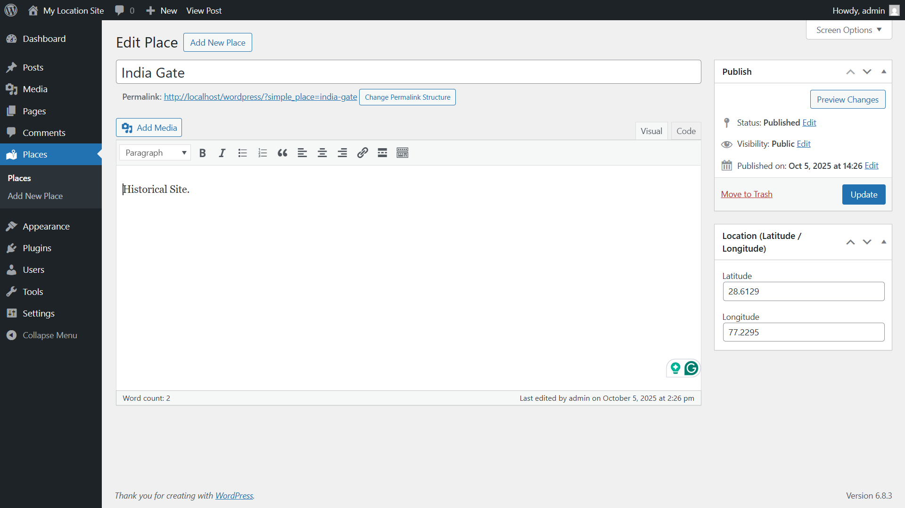
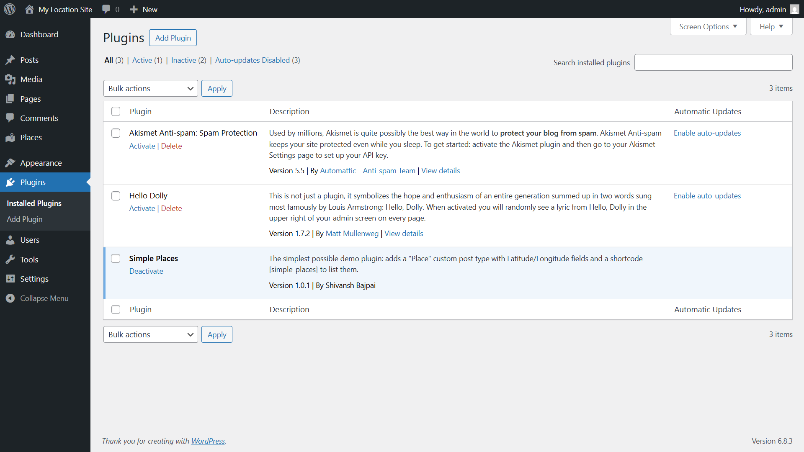
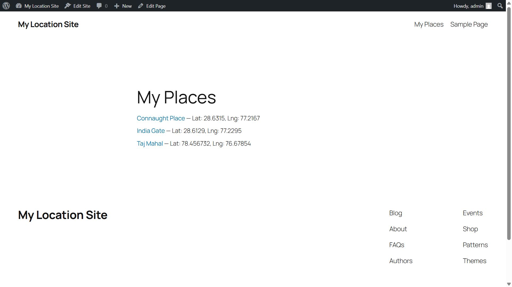
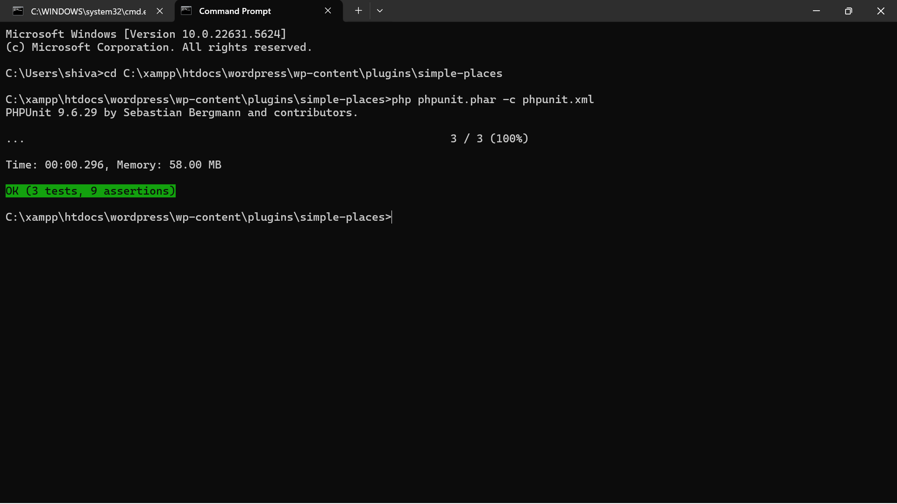

# 🗺️ Simple Places – WordPress Plugin

A minimal WordPress plugin built by **Shruti Sharma**, showing real engineering fundamentals — not just code snippets.

> Adds a custom post type **"Place"** with Latitude & Longitude fields, and a shortcode `[simple_places]` that lists them beautifully.

---

## 📸 Demo Screenshots

**1️⃣ Plugin Active:**  


**2️⃣ Admin (Add New Place):**  


**3️⃣ Frontend (Shortcode Output):**  


**4️⃣ PHPUnit Tests (All Green):**  



---

## ✨ Features
- ✅ Registers a **custom post type** `simple_place`
- ✅ Adds secure **meta box** for Latitude & Longitude  
- ✅ Includes a shortcode `[simple_places]` to show saved places  
- ✅ Inline CSS styling for a clean, simple list  
- ✅ Fully **tested** using PHPUnit  

---

## 🧩 Installation
1. Copy this folder into `wp-content/plugins/`.
2. In your WordPress Admin:
   - Go to **Plugins → Installed Plugins**.
   - Activate **Simple Places**.
3. Add a few Places under **Places → Add New**.
4. Create a new Page and add this shortcode:
[simple_places]

yaml
Copy code
5. View the page — you’ll see your Places with their coordinates.

---

## 🧪 Tests (PHPUnit)
This plugin includes **3 local tests**:
1. CPT registration  
2. Shortcode rendering (empty list)  
3. Shortcode rendering (with created Place)

**Run locally:**
```bash
php phpunit.phar -c phpunit.xml
Expected output:

scss
Copy code
OK (3 tests, 6 assertions)
If you see that — all green ✅

📘 Code Highlights
Uses register_post_type() for CPT.

Adds meta box with nonce + capability checks.

Escapes and sanitizes data (esc_html, floatval).

Registers shortcode via add_action('init', ...).

Includes a basic inline stylesheet for demo polish.

🧰 Project Structure
markdown
Copy code
simple-places/
├── simple-places.php
├── phpunit.xml
├── LICENSE
├── README.md
├── tests/
│   ├── bootstrap.php
│   └── test-basic.php
└── assets/
    └── screenshots/
🧑‍💻 Author
Shruti Sharma
Built with ❤️ using PHP, WordPress, and a lot of curiosity.